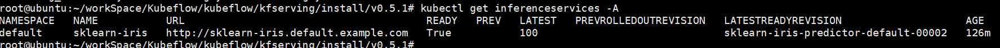
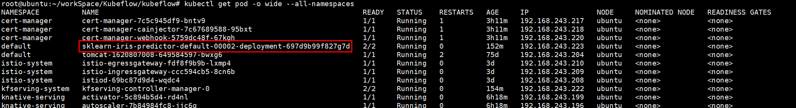
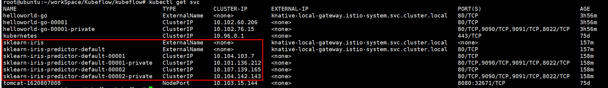
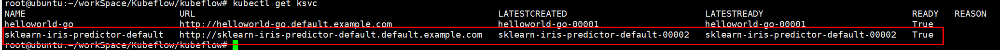
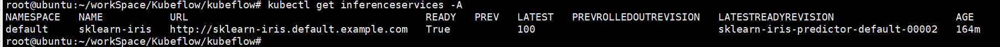
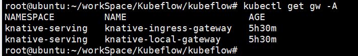
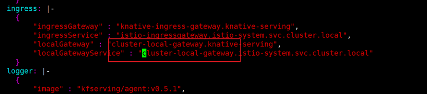
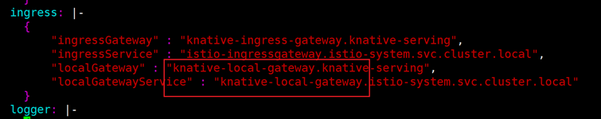

# k8s + istio + knative + kubeflow
## k8s安装
## istio安装
**官方文档: https://istio.io/latest/docs/setup/getting-started/** 
1. 下载istio 1.9.4 (https://github.com/istio/istio/releases/tag/1.9.4)
```
wget https://github.com/istio/istio/releases/download/1.9.4/istio-1.9.4-linux-amd64.tar.gz
```
2. 安装istio
```
tar -zxvf istio-1.9.4-linux-amd64.tar.gz
cd istio-1.9.4
export PATH=$PWD/bin:$PATH
istioctl install --set profile=demo -y
```
3. 部署bookinfo应用进行验证，这里不赘述了。
4. ingress配置,在没有外部load balancer的情况下，可以使用 node port
```
export INGRESS_PORT=$(kubectl -n istio-system get service istio-ingressgateway -o jsonpath='{.spec.ports[?(@.name=="http2")].nodePort}')
export SECURE_INGRESS_PORT=$(kubectl -n istio-system get service istio-ingressgateway -o jsonpath='{.spec.ports[?(@.name=="https")].nodePort}')
export TCP_INGRESS_PORT=$(kubectl -n istio-system get service istio-ingressgateway -o jsonpath='{.spec.ports[?(@.name=="tcp")].nodePort}')
# node ip
export INGRESS_HOST=$(kubectl get po -l istio=ingressgateway -n istio-system -o jsonpath='{.items[0].status.hostIP}')
```

## Knative
**官方文档: https://knative.dev/docs/install/install-serving-with-yaml/**
Yaml下载地址
```
https://github.com/knative/serving/releases/download/v0.22.0/serving-crds.yaml
https://github.com/knative/serving/releases/download/v0.22.0/serving-core.yaml
```
1. 安装istio, 参考istio安装
2. 安装Knative
```
wget https://github.com/knative/serving/releases/download/v0.22.0/serving-crds.yaml
wget https://github.com/knative/serving/releases/download/v0.22.0/serving-core.yaml
# 按照顺序执行下面两行命令
kubectl apply -f serving-crds.yaml
kubectl apply -f serving-core.yaml
```
3. 安装Knative istio controller
```
wget https://github.com/knative/net-istio/releases/download/v0.22.0/net-istio.yaml
kubectl apply -f net-istio.yaml
```
安装过程问题：
* gcr.io开头的镜像无法访问，参考 https://blog.didiyun.com/index.php/2018/11/23/minikube-knative/

### Knative示例
**参考： https://github.com/knative/docs/blob/main/docs/serving/samples/hello-world/helloworld-go/index.md**
1. 准备文件 Dockerfile service.yaml
2. 修改 service.yaml {username}
3. 准备 docker
```
docker build -t {username}/helloworld-go .
docker push {username}/helloworld-go
```
4. 启动
```
kubectl apply --filename service.yaml
```
5. 确认 hello-word 对外服务的域名
```
kubectl get ksvc helloworld-go --output=custom-columns=NAME:.metadata.name,URL:.status.url
# Example
 NAME                URL
 helloworld-go       http://helloworld-go.default.1.2.3.4.sslip.io
```
6. 使用kn部署服务(更上面的方式选用)
```
wget https://github.com/knative/client/releases/download/v0.22.0/kn-linux-amd64
mv kn-linux-amd64 kn
./kn service create helloworld-go --image=docker.io/{username}/helloworld-go --env TARGET="Go Sample v1"
```

## cert manager
```
kubectl apply -f https://github.com/jetstack/cert-manager/releases/download/v1.3.1/cert-manager.yaml
```

## KFServing
版本：v0.5.1
1. 安装kfserving
```
# 下载
git clone https://github.com/kubeflow/kfserving.git
# 这里使用v0.5.1
cd /root/workSpace/Kubeflow/kubeflow/kfserving/install/v0.5.1
# 修改 kfserving.yaml 中gcr.io的镜像为自己的镜像
# 安装
kubectl apply -f kfserving.yaml
```
2. 推理服务demo
```
export API_VERSION="v1beta1"
# 创建推理服务
kubectl apply -f kfserving/docs/samples/${API_VERSION}/sklearn/v1/sklearn.yaml
export INGRESS_HOST=$(kubectl get po -l istio=ingressgateway -n istio-system -o jsonpath='{.items[0].status.hostIP}')
export INGRESS_PORT=$(kubectl -n istio-system get service istio-ingressgateway -o jsonpath='{.spec.ports[?(@.name=="http2")].nodePort}')
SERVICE_HOSTNAME=$(kubectl get inferenceservice sklearn-iris -o jsonpath='{.status.url}' | cut -d "/" -f 3)
```
3. 查看推理服务
```
kubectl get inferenceservices -A
```


4. 调用推理服务
```
curl -v -H "Host: ${SERVICE_HOSTNAME}" http://${INGRESS_HOST}:${INGRESS_PORT}/v1/models/sklearn-iris:predict -d @./kfserving/docs/samples/${API_VERSION}/sklearn/v1/iris-input.json
# 正常输出：{"predictions": [1, 1]}
# 这里可能会存在503问题
```

**503问题**
1. 直接测试pod
```
kubectl get pod -o wide --all-namespaces
```

```
# 直接请求
curl -v http://192.168.243.223:8012/v1/models/sklearn-iris:predict -d @./kfserving/docs/samples/${API_VERSION}/sklearn/v1/iris-input.json
# 结果：{"predictions": [1, 1]} 正确
```
2. 测试svc
```
kubectl get svc
```

```
# 拿到00002-private的地址，直接请求可以得到结果
curl -v http://10.104.142.143/v1/models/sklearn-iris:predict -d @./kfserving/docs/samples/${API_VERSION}/sklearn/v1/iris-input.json
# 结果：{"predictions": [1, 1]} 正确
```
3. 测试ksvc
```
kubectl get ksvc
```

```
# 获取端口
kubectl -n istio-system get service istio-ingressgateway -o jsonpath='{.spec.ports[?(@.name=="http2")].nodePort}'
# 拿到ksvc的地址，直接请求可以得到结果
curl -v -H "Host: sklearn-iris-predictor-default.default.example.com" http://192.168.2.125:31730/v1/models/sklearn-iris:predict -d @./kfserving/docs/samples/${API_VERSION}/sklearn/v1/iris-input.json
# 结果：{"predictions": [1, 1]} 正确
```
4. 测试 inference services
```
kubectl get inferenceservices -A
```

```
# 获取端口
kubectl -n istio-system get service istio-ingressgateway -o jsonpath='{.spec.ports[?(@.name=="http2")].nodePort}'
# 拿到inference services的地址，直接请求
curl -v -H "Host: sklearn-iris.default.example.com" http://192.168.2.125:31730/v1/models/sklearn-iris:predict -d @./kfserving/docs/samples/${API_VERSION}/sklearn/v1/iris-input.json
# 结果：503
```

5. 原因
knative在安装的时候使用了如下两个gateway：

kfserving安装的时候使用的YAML指定了localGateway为cluster-local-gateway，这个gateway并未安装：

解决方式：将YAML的localGateway改为knative-local-gateway，并重新apply YAML：
